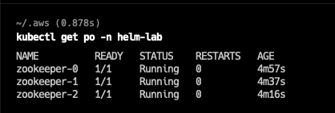

## **Before you start**

* [Helm](https://helm.sh/docs/intro/install/) is installed
* A running kubernetes cluster (minikube, EKS, AKS, GKE, k3s, k8s)
* kubectl is configured to access the right cluster. Verify by running the following commands:
```console
kubectl cluster-info
```
```console
kubectl get nodes
```

## **Add Helm Repository**

The radiantone helm repository is hosted at https://radiantlogic-devops.github.io/helm

#### **Add radiantone repository**

* Run the command below to add ```radiantone``` repo

```console
helm repo add radiantone https://radiantlogic-devops.github.io/helm
```

Verify

* To verify that ```radiantone``` repo is added, run the command below

```console
helm repo list
```
In the output you should see ```radiantone``` added along with other repositories if you have any

(Optional) To update the repo
```console
helm repo update
```
### **Deploying FID/Zookeeper**

####**Creating Namespace**

* Run the below command to create a new namespace to deploy FID/Zookeeper

```console
kubectl create namespace helm-lab
```
Verify:

* To verify if the namespace has been created, run the command below
```console
kubectl get namespace
```
* You should see "helm-lab" in the list of outputs

#### **Deploying Zookeeper**

**Install zookeeper**

```console
helm install --namespace=helm-lab zookeeper radiantone/zookeeper
```
* The above command deploys zookeeper (default with replicaCount=3)
* You will see following response printed to the console
```
helm install --namespace=helm-lab zookeeper radiantone/zookeeper
NAME: zookeeper
LAST DEPLOYED: Wed Apr 13 17:15:31 2022
NAMESPACE: helm-lab
STATUS: deployed
REVISION: 1
NOTES:
1. Get the application URL by running these commands:
  export POD_NAME=$(kubectl get pods --namespace helm-lab -l "app.kubernetes.io/name=zookeeper,app.kubernetes.io/instance=zookeeper" -o jsonpath="{.items[0].metadata.name}")
  echo "Visit http://127.0.0.1:8080/commands to use your application"
  kubectl --namespace helm-lab port-forward $POD_NAME 8080:8080
``` 

Verify

* To verify if zookeeper has been deoployed successfully, run the command below

```console
kubectl get pods -n helm-lab
```
* You will see three zookeeper pods "zookeeper-0/1/2"
<br>

<br> 

**List Zookeeper releases**

* To list the zookeeper releases, run the command below

```console
helm list --namespace=helm-lab
```
#### **Deploying FID**

**Install FID**

Replace the "FID cluster license" with your license:

```console
helm install --namespace=helm-lab fid radiantone/fid \
--set zk.connectionString="zookeeper:2181" \
--set zk.ruok="http://zookeeper:8080/commands/ruok" \
--set fid.license="<FID cluster license>" \
--set fid.rootPassword="test1234"
```
<br>

<br> 

**IMPORTANT NOTE** : Curly brackets in the license key must be escaped --set fid.license="\\{rlib\\}xxx"

Verify

* To verify if fid has been deployed successfully, run the command below

```console
kubectl get pods -n helm-lab
```
* You will see  fid pod ```fid-0```
<br>

<br> 

#### **Accessing Control Panel**
* To access the control panel run the command below

```console
kubectl port-forward svc/fid-ext -n helm-lab 7070
```

Access the control panel at http://localhost:7070

The default username/password is

    cn=Directory Manager
    test1234

#### **Accessing LDAP/ADAP Service**
* To access the LDAP/ADAP service run the command below

```console
kubectl port-forward svc/fid-app -n helm-lab 2389 8089
```

Access the LDAP service at ldap://localhost:2389 from your LDAP browser

Access the ADAP service at http://localhost:8089

The default username/password is

    cn=Directory Manager
    test1234

#### **Scaling Up FID**
Add a new node to the cluster

```console
helm upgrade --namespace=helm-lab fid radiantone/fid --set replicaCount=2
```

Verify

* To verify if fid has been deployed successfully, run the command below

```console
kubectl get pods -n helm-lab
```
* You will see 2 fid pods ```fid-0 fid-1```

**List FID releases**

* To list the fid releases, run the command below

```console
helm list --namespace=helm-lab
```

#### **Advanced**
**Update FID version (optional)**
* The FID cluster must be running at least 2 nodes to update the version
* To upgrade an existing or deployed zookeeper release, run the below command

```console
helm upgrade --namespace=helm-lab fid radiantone/fid --set image.tag=7.4.1-rc1
```
**NOTE:** Check for the latest image releases if the new tag is available [here](https://hub.docker.com/r/radiantone/fid/tags)

## **Cleanup**


* To remove the Zookeeper/FID helm deployments run the commands below

**Removing FID deployment**

```console
helm uninstall --namespace=helm-lab fid
```

Verify

* To verify if the fid depoloyment has been deleted/removed run the command below

```console
kubectl get all -n helm-lab
```

You not see any fid pods, move to the next step

**Removing Zookeeper Deployment**

* To remove Zookeeper deployment run the command below

```
helm uninstall --namespace=helm-lab zk
```

Verify
* To verify if the fid depoloyment has been deleted/removed run the command below

```
kubectl get all -n helm-lab
```

You will not see any zookeeper pods.

**Delete Namespace**

* To delete the namespace that was created, run the command below

```console
kubectl delete namespace helm-lab
```

Verify

* To verify if namespace has been deleted, run the command below

```console
kubectl get namespace
```

You will not find the "helm-lab" in the list of namespaces.


