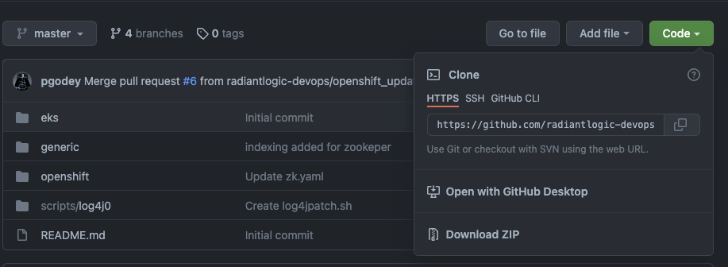
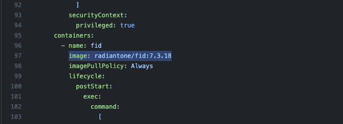
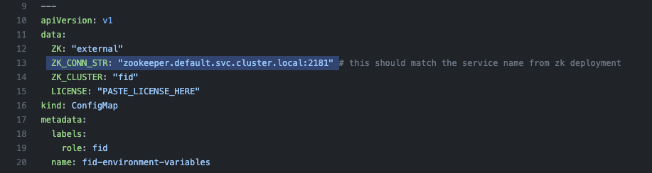
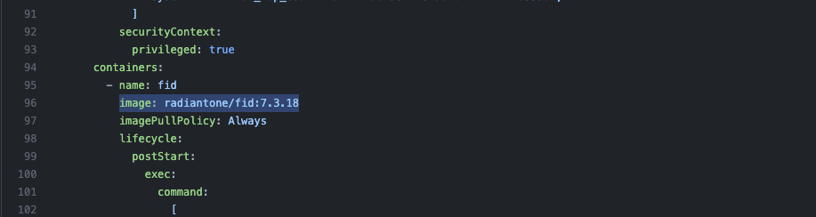

## **Before you start**
* FID or Zookeeper running locally on your machine are stopped.
* Make sure you have a running kubernetes cluster (minikube, EKS, AKS, GKE, k3s, k8s)
* Make sure kubectl is configured to access the right cluster. You can verify that by running the following commands
```console
kubectl cluster-info
```
```console
kubectl get nodes
```

* Clone the kubernetes manifest samples repo
```
git clone https://github.com/radiantlogic-devops/kubernetes.git
```

* Alternatively you can download it from Github page, from internet browser go to
```
https://github.com/radiantlogic-devops/kubernetes.git
```
<br>

<br> 

## **Standalone FID**

### **Creating Namespace**
```
kubcetl create ns lab-00
```
Verify:

* To verify if the namespace is created, run the below command

```console
kubectl get namespace
```

In the list of namespaces from the oputput you will find lab-00

#### Edit Manifest File (fid.yaml)

* From the cloned/downloaded folder navigate to kubernetes/generic/00-cluster-local-zk folder and open the manifest file "fid.yaml" in your code editor

* Update the manifest file `kubernetes/generic/00-cluster-local-zk/fid.yaml` and paste the license key. Look for `PASTE_LICENSE_HERE`, replace and save the file.
<br>

<br> 
* Image, Look for **image: radiantone/fid:7.3.18** and change it to **image: radiantone/fid:7.4.0**
<br>

<br> 

### **Deploying Standalone FID**

* To deploy the standalone FID, run the command below (make sure to follow "Edit Manifest File" before running the command below)

```
kubectl apply -f kubernetes/00-cluster-local-zk/fid.yaml -n lab-00
```
#### To get the status of pods (Pending/Running/Succeeded/Failed/Unknown)

```
kubectl get all -n lab-00
```
When the pod shows 1/1 running status, run the command in the next step to access the control panel

####Accessing the control Panel

To access the control panel of FID, run the command below

```console
kubectl port-forward svc/fid 7070:7070 -n lab-01
```
Access the control panel at **[http://localhost:7070](http://localhost:7070)**

The default username/password is

    cn=Directory Manager
    secret1234

### **Cleanup**

Run the command below to delete the above FID deployment

```console
kubectl delete -f kubernetes/00-cluster-local-zk/fid.yaml -n lab-00
```

Verify:

To verify that the FID deployment has been sucessfully deleted, run the command below

```console
kubectl get all -n lab-00
```

You will no more see any zookeeper or fid pods. Once you verify that there are no zookeeper and FID pods, proceed to the next step

Run the following command to delete the namespace created

```console
kubectl delete ns lab-00
```

Verify:

To verify that the namespace has been deleted, run the command below

```console
kubectl get namespace
```
You should no more see the "lab-00" namespace in the list of namepsaces.

## **FID with External Zookeeper**

### **Creating Namespace**

```console
kubectl create ns lab-01
```

#### Edit Manifest File (fid.yaml)

* From the cloned/downloaded folder navigate to kubernetes/generic/02-cluster-ext-zk folder and open the manifest file "fid.yaml" in your code editor
* Update the manifest file `kubernetes/generic/02-cluster-ext-zk/fid.yaml` and update the following
* ZK Connection String, Look for **"zookeeper.default.svc.cluster.local:2181"** and change to **"zookeeper.lab-01.svc.cluster.local:2181"**
<br>

<br> 
* License Key. Look for `PASTE_LICENSE_HERE`, replace and save the file.
<br>

<br> 
* Image, Look for **image: radiantone/fid:7.3.18** and change it to **image: radiantone/fid:7.4.0**
<br>

<br> 


### **Deploying Zookeeper**

Run the command below to deploy zookeeper

```console
kubectl apply -f kubernetes/01-external-zk/zk.yaml -n lab-01
```

#### To get the status of pods (Pending/Running/Succeeded/Failed/Unknown)

```console
kubectl get all -n lab-01
```

You will see three pods (named zookeeper-0/1/2) 

When all the three pods show 1/1 running status, proceed to the next step

#### Check if zookeeper is up and running

```console
kubectl exec -it zookeeper-0 -- bash -c "export JAVA_HOME=/opt/radiantone/rli-zookeeper-external/jdk/jre/;/opt/radiantone/rli-zookeeper-external/zookeeper/bin/zkServer.sh status"
```
```console
kubectl exec -it zookeeper-1 -- bash -c "export JAVA_HOME=/opt/radiantone/rli-zookeeper-external/jdk/jre/;/opt/radiantone/rli-zookeeper-external/zookeeper/bin/zkServer.sh status"
```
```console
kubectl exec -it zookeeper-2 -- bash -c "export JAVA_HOME=/opt/radiantone/rli-zookeeper-external/jdk/jre/;/opt/radiantone/rli-zookeeper-external/zookeeper/bin/zkServer.sh status"
```
Running the above commands gives the status of zookeeper (leader/follower)

After successfully confirming 2-follower, 1-leader, Zookeeper pods are up, proceed to the next step 

### **Deploying FID**

Run the command below to deploy FID(1 node)

```console
kubectl apply -f kubernetes/02-cluster-ext-zk/fid.yaml -n lab-01
```

#### To get the status of pods (Pending/Running/Succeeded/Failed/Unknown)

```console
kubectl get all -n lab-01
```
You will see one pod  (named fid-0)

When the pod fid-0 shows 1/1 running status, proceed to next step

####Accessing the control Panel

To access the control panel of FID, run the command below

```console
kubectl port-forward svc/fid 7070:7070 -n lab-01
```
Access the control panel at **[http://localhost:7070](http://localhost:7070)**

The default username/password is

    cn=Directory Manager
    secret1234


### **Cleanup**

Run the command below to delete the FID deployment

```console
kubectl delete --f kubernetes/02-cluster-ext-zk/fid.yaml -n lab-01
```

Verify:

To verify that the FID deployment has been deleted, run the command below

```console
kubectl get all -n lab-01
```

You will no more see the "fid-0" pod, once you verify that there are no more fid pods, proceed to the next step

Run the command below to delete the zookeeper deployment

```console
kubectl delete -f kubernetes/01-external-zk/zk.yaml -n lab-01
```

Verify:

To verify that the Zookeeper deployment has been sucessfully deleted, run the command below

```console
kubectl get all -n lab-01
```

You will no more see any zookeeper-0,1,2 pods. Once you verify that there are no zookeeper pods, proceed to the next step

Run the following command to delete the namespace created

```console
kubectl delete ns lab-01
```

Verify:

To verify that the namespace has been deleted, run the command below

```console
kubectl get ns
```
You should no more see the "lab-01" namespace in the list fo namepsaces.