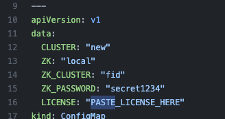
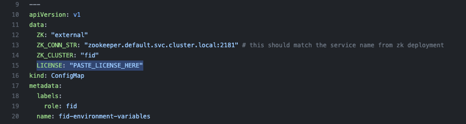

## **Before you start**
* FID or Zookeeper running locally on your machine are stopped.
* Make sure you have a running kubernetes cluster (minikube, EKS, AKS, GKE, k3s, k8s)
* If using minikube, see the minikube section
#### kubectl
* Make sure kubectl is configured to access the right cluster. You can verify that by running the following commands
```console
kubectl cluster-info
```
```console
kubectl get nodes
```
#### Manifest files
* Clone the kubernetes manifest samples repo
```
git clone https://github.com/radiantlogic-devops/kubernetes.git
```

* Alternatively you can download it from Github page, from internet browser go to
```
https://github.com/radiantlogic-devops/kubernetes.git
```
<br>

<br> 

## **Standalone FID**

### **Creating Namespace**
```
kubectl create ns lab-00
```
Verify:

* To verify if the namespace is created, run the below command

```console
kubectl get namespace
```

In the list of namespaces from the output you should see ```lab-00```

#### Edit Manifest File (fid.yaml)

* From the cloned/downloaded folder navigate to kubernetes/generic/00-cluster-local-zk folder and open the manifest file ```fid.yaml``` in your code editor.
* Update the manifest file `kubernetes/generic/00-cluster-local-zk/fid.yaml` and paste the license key. Look for `PASTE_LICENSE_HERE`, replace it with a valid RadiantOne cluster license key and save the file.
<br>

<br> 
* For Mac M1, update the image ```radiantone/fid:7.4.0-arm64```

### **Deploying Standalone FID**

* To deploy the standalone FID, run the command below (make sure to follow "Edit Manifest File" before running the command below)

```
kubectl apply -f kubernetes/generic/00-cluster-local-zk/fid.yaml -n lab-00
```
#### Check status 

* To get the status of pods (Pending/Running/Succeeded/Failed/Unknown)

```
kubectl get po -n lab-00
```
When the pod shows 1/1 running status, proceed to the next step. It could take anywhere from 2 to 5 minutes to start.

* To view logs
```
kubectl logs -f fid-0 -n lab-00
```

####Accessing the Control Panel
** Open a new command prompt for port forwarding.

* To access the control panel of FID, run the command below

```console
kubectl port-forward svc/fid-cp -n lab-00 7070 8089
```
Access the control panel at **[http://localhost:7070](http://localhost:7070)**

Access the ADAP service at http://localhost:8089

The default username/password is

    cn=Directory Manager
    secret1234

#### **Accessing LDAP Service**
** Open a new command prompt for port forwarding.

* To access the LDAP service run the command below

```console
kubectl port-forward svc/fid -n lab-00 2389
```

Access the LDAP service at ldap://localhost:2389 from your LDAP browser

The default username/password is

    cn=Directory Manager
    test1234

### **Cleanup**

* Run the command below to delete the above FID deployment

```console
kubectl delete -f kubernetes/generic/00-cluster-local-zk/fid.yaml -n lab-00
```
(If needed run this command to forcefully terminate the pod)
```
kubectl delete po/fid-0 -n lab-00 --force
```
Verify:

To verify that the FID deployment has been sucessfully deleted, run the command below

```console
kubectl get all -n lab-00
```

You will no more see any zookeeper or fid pods. Once you verify that there are no zookeeper and FID pods, proceed to the next step

* Run the following command to delete the namespace created

```console
kubectl delete ns lab-00
```

Verify:

To verify that the namespace has been deleted, run the command below

```console
kubectl get namespace
```
You should no more see the "lab-00" namespace in the list of namepsaces.

## **FID with External Zookeeper**

### **Creating Namespace**

```console
kubectl create ns lab-01
```

#### Edit Manifest File

* From the cloned/downloaded folder navigate to kubernetes/generic/02-cluster-ext-zk folder and open the manifest file "fid.yaml" in your code editor
* Update the manifest file `kubernetes/generic/02-cluster-ext-zk/fid.yaml` and update the following
* License Key. Look for `PASTE_LICENSE_HERE`, replace it with a valid RadiantOne cluster license key and save the file.
<br>


### **Deploying Zookeeper**

* Run the command below to deploy zookeeper

```console
kubectl apply -f kubernetes/generic/01-external-zk/zk.yaml -n lab-01
```

#### Check status 
To get the status of pods (Pending/Running/Succeeded/Failed/Unknown)

```console
kubectl get po -n lab-01
```
(use -w flag to watch the progress)
```console
kubectl get po -n lab-01 -w
```

You will see three pods (named zookeeper-0/1/2) 

When all the three pods show 1/1 running status, proceed to the next step

(Optional) Check if zookeeper is up and running, and which node is the leader

```console
kubectl exec -it zookeeper-0 -n lab-01 -- bash -c "export JAVA_HOME=/opt/radiantone/rli-zookeeper-external/jdk/jre/;/opt/radiantone/rli-zookeeper-external/zookeeper/bin/zkServer.sh status"
```
```console
kubectl exec -it zookeeper-1 -n lab-01 -- bash -c "export JAVA_HOME=/opt/radiantone/rli-zookeeper-external/jdk/jre/;/opt/radiantone/rli-zookeeper-external/zookeeper/bin/zkServer.sh status"
```
```console
kubectl exec -it zookeeper-2 -n lab-01 -- bash -c "export JAVA_HOME=/opt/radiantone/rli-zookeeper-external/jdk/jre/;/opt/radiantone/rli-zookeeper-external/zookeeper/bin/zkServer.sh status"
```

### **Deploying FID**

* Run the command below to deploy FID (1 node)

```console
kubectl apply -f kubernetes/generic/02-cluster-ext-zk/fid.yaml -n lab-01
```

#### Check status 
To get the status of pods (Pending/Running/Succeeded/Failed/Unknown)

```console
kubectl get po -n lab-01
```
You will see one pod  (named fid-0)

To check the logs and see the progress or see the progress on the kubernetes dashboard
```console
kubectl logs -f fid-0 -n lab-01
```
When the pod fid-0 shows 1/1 running status, proceed to next step

It might take anywhere from 3 to 5 minutes for the pod to be ready

Cluster status
```
kubectl exec -it fid-0 -n lab-01 -- cluster.sh list
```

####Accessing the Control Panel

* To access the control panel of FID, run the command below

```console
kubectl port-forward svc/fid-cp -n lab-01 7070 8089
```
Access the control panel at **[http://localhost:7070](http://localhost:7070)**

The default username/password is

    cn=Directory Manager
    secret1234

#### **Accessing LDAP Service**
* To access the LDAP service run the command below

```console
kubectl port-forward svc/fid -n lab-00 2389
```

Access the LDAP service at ldap://localhost:2389 from your LDAP browser

The default username/password is

    cn=Directory Manager
    test1234

#### **Scaling Up FID**
* Add a new node to the cluster

```console
kubectl scale sts/fid --replicas=2 -n lab-01
```

Verify

To verify if fid has been scaled up successfully, run the command below

```console
kubectl get pods -n lab-01
```
You will see 2 fid pods ```fid-0 fid-1```

#### **Scaling Down FID**
* Remove a node from the cluster

```console
kubectl scale sts/fid --replicas=1 -n lab-01
```

Verify

To verify if fid has been scaled down successfully, run the command below

```console
kubectl get pods -n lab-01
```
You will see 1 fid pod ```fid-0```

### **Advanced (Optional)**
#### **Update FID version**
* The FID cluster must be running at least 2 nodes to update the version
* Scale the statefulset to 2 replicas
* This will perform a rolling update of each node
* To upgrade an existing or deployed radiantone release, run the below command
```console
kubectl scale sts/fid --replicas=2 -n lab-01
```
```
kubectl set image sts/fid fid=radiantone/fid:7.4.1 -n lab-01
```

#### Export Configuration
* Export the configration of FID in the container
```
kubectl exec -it fid-0 -n lab-01 -- ./migrate.sh export lab-01-export.zip
```
* Copy file from container to local machine
```
kubectl cp fid-0:/opt/radiantone/vds/work/lab-01-export.zip lab-01-export.zip -n lab-01
```

#### Import Configuration
* Copy file from local machine to container
```
kubectl cp lab-01-export.zip fid-0:/opt/radiantone -n lab-01
```
* Import the configration to FID in the container
```
kubectl exec -it fid-0 -n lab-01 -- ./migrate.sh import /opt/radiantone/lab-01-export.zip
```

### **Cleanup**

* Run the command below to delete the FID deployment

```console
kubectl delete -f kubernetes/generic/02-cluster-ext-zk/fid.yaml -n lab-01
```
Verify:

To verify that the FID deployment has been deleted, run the command below

```console
kubectl get all -n lab-01
```

* Run the command below to delete the zookeeper deployment

```console
kubectl delete -f kubernetes/generic/01-external-zk/zk.yaml -n lab-01
```

Verify:

To verify that the Zookeeper deployment has been sucessfully deleted, run the command below

```console
kubectl get all -n lab-01
```

* Run the following command to delete the namespace created

```console
kubectl delete ns lab-01
```

Verify:

To verify that the namespace has been deleted, run the command below

```console
kubectl get ns
```
You should no more see the "lab-01" namespace in the list fo namespaces.
